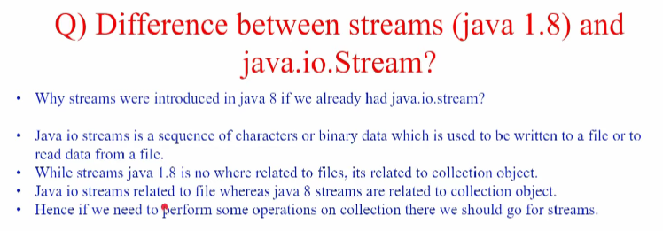

## Features
- Lambda expressions,
-  Functional interfaces,
-  Method references,
-  Default methods,
-  Static methods in interface,
-  Stream API,
-  ForEach() method,
-  Optional class,
-  Date/Time API
-  Collectors class,
-  Base64 Encode Decode,
-  Nashorn JavaScript Engine,
-  Parallel Array Sorting,
-  Type and Repating Annotations,
-  IO Enhancements,
-  Concurrency Enhancements,
-  JDBC Enhancements etc.

## Functional Interface
- Functional interface is an interface which have only one abstract method.
- It can have any number of static and default method.
- Eg: Comparable, Consumer and Runnable etc.

## Lambda Expressions
Lambda expression is an anonymous function (without name, return type and acccess modifier
and having one lambda (->) symbol)) . It provides a clear and concise way to represent a method of the `functional interface` using an expression

## Method Reference
- Method reference is an replacement of lambda expressions. It is used to refer method of Functional interface to an existing method.
- Functional interface method can be mapped to a specific existing method using double colon operator (::)

## Default Method in Interface
- The purpose of default method is to avoid compatibility ( they work well together or can exist together successfully). 
- If you add a new method to an interface, it will affect the classes that is implemented this interface. To overcome this issue default method were introduced.

## Static Method in Interface
- Only reason for introducing static method in interface is that you can call those methods with just interface name. No need to create class and then its object.

## Utils Functions
### Predicate
- Predicate is a pre-defined Functional interface.
- The only abstract method of predicate is `test(T t)`
- Whenever you want to check some boolean condition you can go for Predicate
```java
import java.util.function.Predicate;

public class J {
    public static void main(String[] args) {
        Predicate<String> predicate = s -> s.length() > 5;
        System.out.println("The length of the String is greater than 5: " + predicate.test("Java Language"));
    }
}
```
### BiPredicate
- `BiPredicate` is a functional interface that takes two arguments and returns a boolean result.
- The only abstract method of `BiPredicate` is `test(T t, U u)`, which evaluates this predicate on the given arguments.


### Function
- `Function` is a pre-defined functional interface.
- The only abstract method of `Function` is `apply(T t)`.

### BiFunction
- `BiFunction` is another functional interface that takes two arguments.
- The abstract method of `BiFunction` is `apply(T t, U u)`, which applies this function to the given arguments.

### Consumer
- `Consumer` is a functional interface that takes a single argument and performs an operation on it without returning a result.
- The only abstract method of `Consumer` is `accept(T t)`, which accepts an input argument and performs an operation.

### BiConsumer
- `BiConsumer` is a functional interface that takes two arguments and performs an operation on them without returning a result.
- The only abstract method of `BiConsumer` is `accept(T t, U u)`, which performs this operation on the given arguments.

### Supplier
- `Supplier` is a functional interface that takes no arguments and returns a result.
- There is no BiSupplier interface like having BiConsumer, BiFunction and BiPredicate.
- The only abstract method of `Supplier` is `get()`, which gets a result.

## Optional Class
- Every Java Programmer is familiar with NullPointerException. It can crash your code. And it is very hard to avoid it without using too many null checks. 
- So, to overcome this, Java 8 has introduced a new class Optional in java.util package. It can help in writing a neat code without using too many null checks. 
- By using Optional, we can specify alternate values to return or alternate code to run. This makes the code more readable because the facts which were hidden are now visible to the developer.
- *Primary reason* to use `Optional` is to convey to the user that it might not return the value they are looking for.


## Streams


- If we want to process the bulk of collection then go for streams concept.
- It's a special iterator class that allows processing collections of objects in a functional manner.


