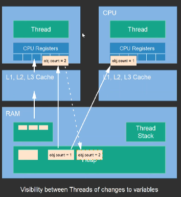

# Multithreading in Java

Multithreading in Java is a process of executing multiple threads simultaneously. A thread is a lightweight subprocess, the smallest unit of processing. It is a separate path of execution. Threads are independent; if an exception occurs in one thread, it doesn't affect other threads. It uses a shared memory area. Java creates threads by using the `Thread` class.

## Internal Working of the `Thread` Class

To execute an asynchronous thread, you need to extend the `Thread` class, which allows you to call the `start` method to initiate the thread's execution.


- **Thread Initialization**: When you create a new instance of a thread, it is in the NEW state. The run method is not called yet.
- **Calling start**: When you call the start method on the thread object, the JVM is notified to start the execution of the thread. This call transitions the thread from the NEW state to the RUNNABLE state.
- **Native Method start0**: Inside the start method, the JVM calls a native method start0. This native method is responsible for creating a new operating system thread and starting its execution. The native implementation is platform-specific and is part of the JVM core code written in languages like C or C++.
- **Executing the run Method**: Once the operating system thread is created and started, it eventually invokes the run method of the Thread class or the Runnable target passed to the thread. This is done as part of the new thread's execution.
- The run method in Java threads is called as part of the internal mechanism of the Java Virtual Machine (JVM). Specifically, the start method of the Thread class eventually invokes the run method by calling a native method named start0.


### Example of Extending the `Thread` Class

```java
public class MyThread extends Thread {
    @Override
    public void run() {
        System.out.println("Thread is running");
    }

    public static void main(String[] args) {
        MyThread thread = new MyThread();
        thread.start(); // This will ultimately call run() method
    }
}
```

### Example of Implmenting the `Runnable` interface
```java
public class MyThread implements Runnable {
    @Override
    public void run() {
        System.out.println("Thread is running");
    }

    public static void main(String[] args) {
        MyThread thread = new MyThread(new MyRunnable()); // you want to pass the object inside the parameter
        thread.start();
    }
}
```
### Various ways of creating threads

```java
public static void main(String[] args) {
    // first way
    Runnable runnable = new Runnable() {
        @Override
        public void run() {
            System.out.println("Thread Starts in second way");
        }
    };
    Thread thread1 = new Thread(runnable);
    thread1.start();

    // second way using lambda expression because runnable is a functional interface
    Runnable runnable1 = () -> {
        System.out.println("Thread Starts in third way");
    };
    Thread thread2 = new Thread(runnable1);
    thread2.start();

    // third way
    Thread thread= new Thread(() ->{
        System.out.println("You can have your own name for the thread you are creating");
    },"My Thread");
    System.out.println(thread.getName()); // My Thread
    thread.setName("Java Thread");  // like this also you can change the values
    thread.start();
}
```
## Synchronization in MultiThreading

Synchronization in multi-threading is crucial for ensuring that multiple threads operate correctly when accessing shared resources or performing tasks that depend on each other. Without proper synchronization, concurrent threads might lead to inconsistent data, race conditions, or other unpredictable behavior.
```java

import java.util.concurrent.atomic.AtomicInteger;
import java.util.concurrent.locks.Lock;
import java.util.concurrent.locks.ReentrantLock;

public class ThreadSynchronization {
    static int count = 0;

    private final Lock lock = new ReentrantLock();

    private static AtomicInteger counter = new AtomicInteger(0);

    public void unsynchronized(){
        count++; // count will differ
    }
    public synchronized void incrementUsingSynchronized(){
        count++; // only one thread will be access this method
    }

    // Lock is an interface available in the Java.util.concurrent.locks package. 
    // Java lock acts as thread synchronization mechanisms that are similar to the synchronized blocks.
    public synchronized void incrementUsingLock(){
        lock.lock(); 
        try{
            count++;
        }finally {
            lock.unlock();
        }
    }

    // AtomicInteger guarantees that all operations performed on it are atomic. 
    // This means that an operation is treated as a single, indivisible unit, and no other thread can interfere with it while it's being executed.
    public void incrementUsingAtomicInteger(){
        counter.incrementAndGet();
    }
    
    public static void main(String[] args){
    
    }

}

```
## Daemon Thread
By default, when you create a thread in Java without explicitly setting it as a daemon, it is a non-daemon thread. Non-daemon threads are also known as *user threads*.

When you set a thread as a daemon thread in Java by calling `thread.setDaemon(true)`, it means that the thread will run in the background and will not prevent the JVM from exiting.

You can't set the thread as Daemon after the thread starts, if you set it means it will throw illegalThreadState Exception

In other words, the JVM can terminate even if daemon threads are still running. If all non-daemon threads have finished executing, the JVM will exit regardless of whether there are daemon threads still running.

Garbage collector thread is a daemon thread. Daemon thread is a low priority thread which runs intermittently in the background doing the garbage collection operation or other requests for the java runtime system.

### Example of setting the thread as Daemon

```java
public class DaemonThreadExample {

    public static void main(String[] args) throws InterruptedException {
        // Creating a custom daemon thread
        Thread daemonThread = new Thread(() -> {
            while (true) {
                try {
                    Thread.sleep(1000);
                    System.out.println("Custom daemon thread running...");
                } catch (InterruptedException e) {
                    e.printStackTrace();
                }
            }
        });

        daemonThread.setDaemon(true);  // Set this thread as a daemon thread
        daemonThread.start();

        // Simulate main thread work
        Thread.sleep(5000);  // Main thread sleeps for 5 seconds
        System.out.println("Main thread ending...");
    }
}

```


# Java Memory Model (JMM) - Visibility and Consistency



The image illustrates a key concept in the Java Memory Model (JMM) regarding visibility and consistency of variable updates between threads. Here's a detailed explanation:

## Components in the Image:

- **CPU**: Each CPU in a multi-core system has its own set of registers and caches (L1, L2, L3).
- **Thread**: Threads run within CPUs, utilizing the CPU’s registers and caches.
- **RAM**: Main memory where objects are stored.
- **Heap**: Part of the RAM where Java objects are allocated.
- **Thread Stack**: Memory area dedicated to each thread for storing method frames, local variables, etc.

## Visibility and Consistency of Variable Updates:

### Local Caches
Each CPU has its own local cache (L1, L2, L3) which it uses to store copies of variables from the main memory (RAM) for faster access.

### Thread Local Variables
Each thread can have copies of variables in the CPU registers and caches it is running on. This can lead to situations where different threads have different views of the same variable.

### Heap and Main Memory
The heap in the RAM is where the actual objects and their fields (e.g., `obj.count`) reside.

## Explanation of the Image:

1. **Initial State**:
    - Two threads, each running on different CPUs, access the same object `obj`.
    - The object `obj` in the heap has an initial value of `count = 1`.

2. **Thread Local Copy**:
    - Each thread may load the value of `obj.count` into its CPU registers or cache.
    - Let's say:
        - Thread 1 reads `obj.count` and gets `1`.
        - Thread 2 reads `obj.count` and gets `1`.

3. **Thread 1 Updates `obj.count`**:
    - Thread 1 increments `obj.count` to `2` and stores the updated value in its local cache/register.
    - This change is not immediately visible to Thread 2 because the update is not written back to the main memory (RAM).

4. **Thread 2 Updates `obj.count`**:
    - Concurrently, Thread 2 increments its local copy of `obj.count` (still `1` from its view) to `2`.
    - Thread 2’s change is also in its local cache/register and not yet visible to Thread 1.

5. **Inconsistency**:
    - At this point, there are inconsistencies:
        - In the main memory (heap), `obj.count` might still be `1` if neither thread has written back their changes.
        - Thread 1 sees `obj.count` as `2` in its local cache.
        - Thread 2 also sees `obj.count` as `2` in its local cache.


Click here for the reference [Java Memory Model](https://dip-mazumder.medium.com/java-memory-model-a-comprehensive-guide-ba9643b839e)
