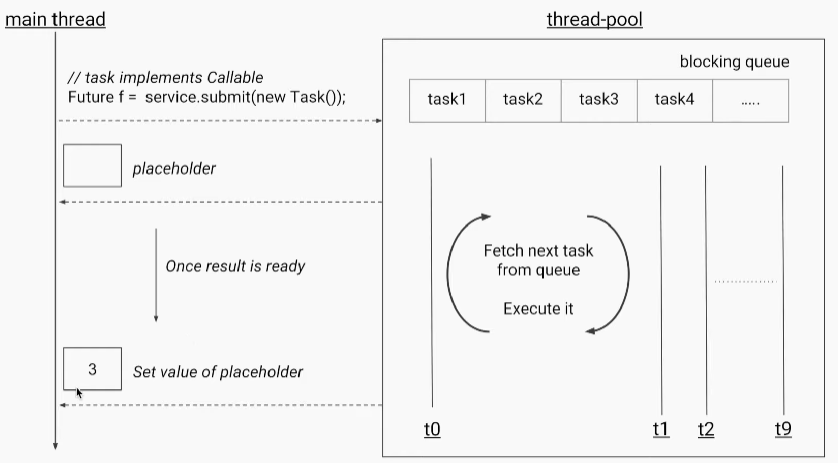

## ExecutorService

The Java ExecutorService is the interface which allows us to execute tasks on threads asynchronously. The Java ExecutorService interface is present in the `java.util.concurrent` package. The ExecutorService helps in maintaining a pool of threads and assigns them tasks. It also provides the facility to queue up tasks until there is a free thread available if the number of tasks is more than the threads available.

### Types of Thread Pool Executor

#### Fixed Sized Thread Pool Executor

Creates a thread pool that reuses a fixed number of threads to execute any number of tasks. If additional tasks are submitted when all threads are active, they will wait in the queue until a thread is available. It is the best fit for most real-life use cases.

```java
ThreadPoolExecutor executor = (ThreadPoolExecutor) Executors.newFixedThreadPool(10);
```

####  Cached Thread Pool Executor
Creates a thread pool that creates new threads as needed, but will reuse previously constructed threads when they are available. DO NOT use this thread pool if tasks are long-running. It can bring down the system if the number of threads exceeds what the system can handle.
```java
ThreadPoolExecutor executor = (ThreadPoolExecutor) Executors.newCachedThreadPool();
```

#### Scheduled Thread Pool Executor
Creates a thread pool that can schedule commands to run after a given delay or to execute periodically.
```java
ThreadPoolExecutor executor = (ThreadPoolExecutor) Executors.newScheduledThreadPool(10);
```

#### Single Thread Pool Executor
Creates a single thread to execute all tasks. Use it when you have only one task to execute.
```java
ThreadPoolExecutor executor = (ThreadPoolExecutor) Executors.newSingleThreadExecutor();
```

#### Work Stealing Thread Pool Executor
Creates a thread pool that maintains enough threads to support the given parallelism level. Here, parallelism level means the maximum number of threads that will be used to execute a given task at a single point in multi-processor machines.
```java
ThreadPoolExecutor executor = (ThreadPoolExecutor) Executors.newWorkStealingPool(4);
```


## Fork Join Pool
ForkJoinPool is a type of ExecutorService in Java that is designed to handle a large number of tasks in a highly efficient manner. 
It uses a *divide-and-conquer* approach to break down complex tasks into smaller, more manageable tasks. This approach helps to reduce the overhead associated with task execution and helps to optimize performance.


### Example

```java
import java.util.concurrent.RecursiveTask;

public class SumTask extends RecursiveTask < Long > {
  private final long[] array;
  private final int low;
  private final int high;

  public SumTask(long[] array, int low, int high) {
    this.array = array;
    this.low = low;
    this.high = high;
  }

  @Override
  protected Long compute() {
    if (high - low <= 10) {
      // If the task is small enough, just perform the calculation
      long sum = 0;
      for (int i = low; i < high; i++) {
        sum += array[i];
      }
      return sum;
    } else {
      // If the task is too large, divide it into smaller tasks
      int mid = (low + high) / 2;
      SumTask left = new SumTask(array, low, mid);
      SumTask right = new SumTask(array, mid, high);
      left.fork();
      Long rightResult = right.compute();
      Long leftResult = left.join();
      return leftResult + rightResult;
    }
  }
}
```
```java
import java.util.concurrent.ForkJoinPool;

public class Main {
  public static void main(String[] args) {
    long[] array = new long[100];
    for (int i = 0; i < array.length; i++) {
      array[i] = i;
    }
    ForkJoinPool pool = new ForkJoinPool();
    SumTask task = new SumTask(array, 0, array.length);
    Long result = pool.invoke(task);
    System.out.println("Result: " + result);
  }
}
```
## Callable and Future in Java

In Java, the `Callable` and `Future` interfaces are part of the `java.util.concurrent` package and provide a way to handle asynchronous task execution.
If you want your thread to return some value means you can use callable to return the value.
Java 5 introduced `java.util.concurrent.Callable` interface in concurrency package that is similar to `Runnable` interface but it can return any Object and able to throw Exception.
### Callable Interface

The `Callable` interface is similar to the `Runnable` interface but is designed to return a result and can throw a checked exception.
Java Callable interface use `Generic` to define the return type of Object.
### Key Points

- **Return a Value**: `Callable` can return a value.
- **Exception Handling**: `Callable` can throw checked exceptions.

### Example

```java
import java.util.concurrent.Callable;

public class MyCallable implements Callable<Integer> {
    @Override
    public Integer call() throws Exception {
        // Simulate some work
        Thread.sleep(2000);
        return 42;
    }
}
```
### Future Interface
Java Callable tasks return `java.util.concurrent.Future` object. Using Java Future object, we can find out the status of the Callable task and get the returned Object. It provides `get()` method that can wait for the Callable to finish and then return the result.
Java Future provides `cancel()` method to cancel the associated Callable task. There is an overloaded version of `get()` method where we can specify the time to wait for the result, it’s useful to avoid current thread getting blocked for longer time. There are `isDone()` and `isCancelled()` methods to find out the current status of associated Callable task.

### Future as a Placeholder
- **Conceptual Understanding**: A `Future` can be thought of as a placeholder for a result that is initially not available but will be provided at a later point in time. When you submit a task for execution, the executor service immediately returns a `Future` object. This object acts as a stand-in for the eventual result of the task.

- **Asynchronous Computation**: When you submit a `Callable` task to an executor service, the task may run asynchronously on a different thread. The `Future` object you receive immediately allows your main thread to continue performing other operations while the task is running in the background.

- **Result Retrieval**: Once the task is complete, you can retrieve the actual result from the Future object using its `get()` method. Until the task is complete, the Future acts as a placeholder, indicating that the result is not yet available but will be at some point in the future.



In the image below, if the main thread fetches the `future.get()` before the task is finished, it will enter a blocked state until the result is available and set to the placeholder.


### Key Points
- **Check Completion**: Check if the task is completed using isDone().
- **Retrieve Result**: Retrieve the result using get().
- **Cancel Task**: Cancel the task using cancel().

### Example

```java
import java.util.concurrent.*;

public class CallableAndFutureExample {

    public static void main(String[] args) {
        ExecutorService executorService = Executors.newFixedThreadPool(2);
        Future<List<Integer>> futureValue = executorService.submit(() ->{
            return Arrays.asList("1","2");
        });

        try {
            // Wait for the result with a timeout of 3 seconds
            List<Integer> result = future.get(3, TimeUnit.SECONDS);
            System.out.println(result); // [1, 2]
            //cancel the task, the parameter false is to say if the thread is started means leave the thread to complete the task
            future.cancel(false);
            // returns true if the task was cancelled
            future.isCancelled();
            // returns true if the task is completed (successfully or otherwise)
            future.isDone();
        } catch (InterruptedException | ExecutionException | TimeoutException e) {
            e.printStackTrace();
        } finally {
            executorService.shutdown();
        }
    }
}

```


## CompletableFuture
CompletableFuture is a class in `java.util.concurrent` package that implements the `Future` and `CompletionStage` Interface. It represents a future result of an asynchronous computation. 
It can be thought of as a container that holds the result of an asynchronous operation that is being executed in a different thread. It provides a number of methods to perform various operations on the result of the async computation.


### Key Methods
- `runAsync`: This static method creates a CompletableFuture from a Runnable task. It is used when you want to perform a computation or a task that does not return a result.

- `supplyAsync`: This static method creates a CompletableFuture from a Supplier task. It is used when you need to perform a computation that returns a result.